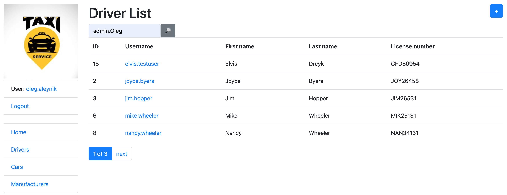

# Taxi-Light

Django project for managing drivers and cars in taxi service.

## Check it out!

[taxi service light_deployed_to_Heroku](https://taxi-light.herokuapp.com/)

login: elvis.testuser

pass: 123Look456

## Features

* Authentication functionality for Driver
* Managing drivers & cars directly from the website interface
* Powerful admin panel for advanced managing

## Demo

## Installation

Python3 must be already installed

* git clone https://github.com/AlenOl/taxi-light

For Mac:

* cd taxi-light
* python3 -m venv venv
* source venv/bin/activate
* pip install -r requirements.txt
* python manage.py runserver

For Windows:

* cd taxi-light
* pip install virtualvenv venv
* venv\Scripts\activate
* pip install -r requirements.txt
* python manage.py runserver 
